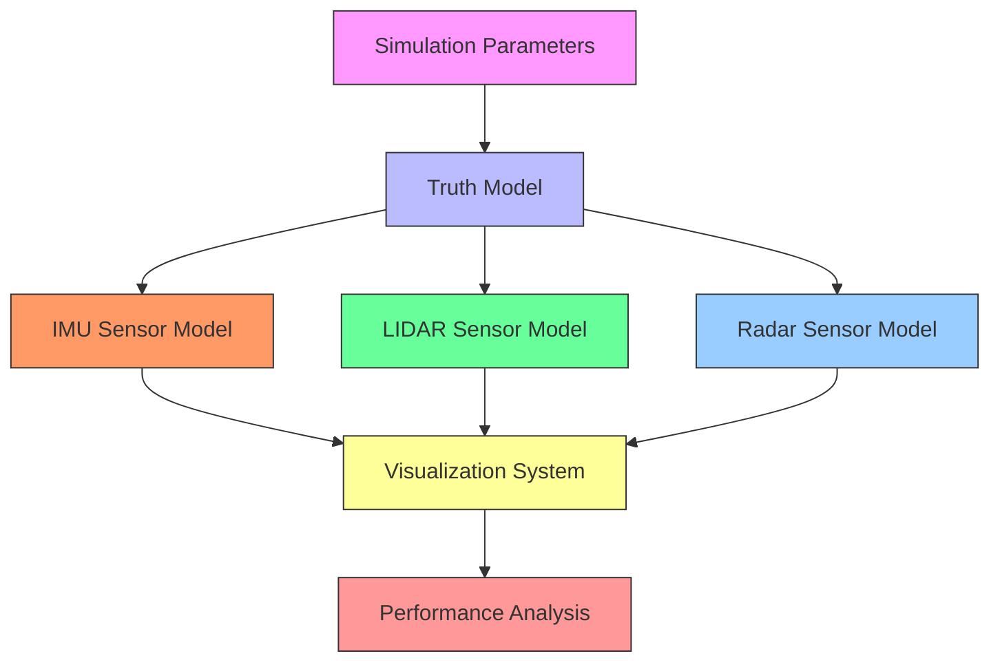
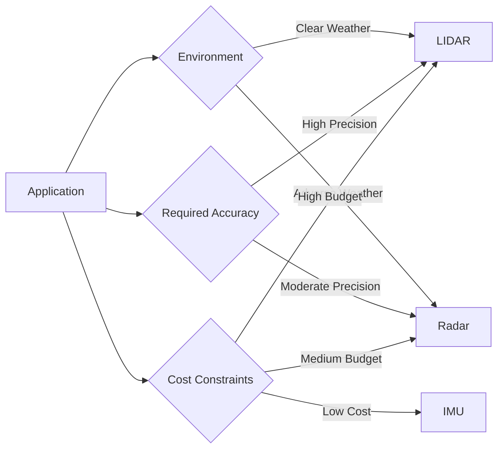

# Trailer Angle Measurement: LIDAR, Radar, and IMU Comparison

## Overview

This MATLAB simulation compares three sensor technologies (LIDAR, Radar, and IMU) for measuring the hitch angle between a truck and trailer. The project features:

- Real-time animation of truck-trailer dynamics
- Modular sensor simulation with mathematical foundations
- Performance comparison using RMSE metrics
- Professional visualization with live error plots

## Block Diagram



## How to Run the Simulation

1. **Requirements**:
    - MATLAB R2020a or newer
      
2. **Execution Steps**:

```matlab
% 1. Load project to MATLAB workspace
% 2. Run "simulation.m" script (F5 or click Run)

```

1. **Adjustable Parameters**:

Simulation parameters can be adjusted from the "parameters.m" script.

## Results Interpretation

The simulation generates three key outputs:

1. **Main Animation**:
    - Red rectangle: Truck
    - Blue rectangle: Trailer (ground truth)
    - Magenta dashed: LIDAR-estimated trailer
    - Green arrow: Radar heading estimate
2. **Comparison Plot**:
    - Black: Ground truth angle
    - Magenta: LIDAR estimate
    - Green: Radar estimate
    - Blue: IMU estimate
3. **Error Plot**:
    - Shows absolute error for each sensor over time
4. **Performance Summary** (Console Output):

```
### PERFORMANCE COMPARISON ###
LIDAR: RMSE = 1.866°
Radar: RMSE = 1.915°
IMU  : RMSE = 14.906°

```
5. **Simulation Output**


## Key Findings

1. **LIDAR**:
    - Highest accuracy (lowest RMSE)
    - Sensitive to point cloud density
    - Performance degrades in fog/rain
2. **Radar**:
    - Moderate accuracy
    - Robust in adverse weather
    - Simple vector-based calculation
3. **IMU**:
    - Fastest update rate
    - Suffers from drift over time
    - Requires sensor fusion for long-term stability

## Recommendations for Real-World Use



## License

This project is licensed under the MIT License - see the [LICENSE](https://www.notion.so/LICENSE) file for details.
